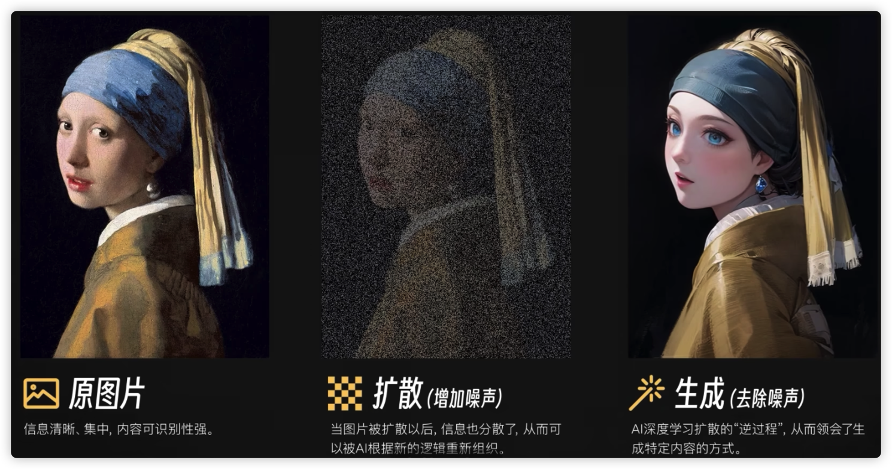
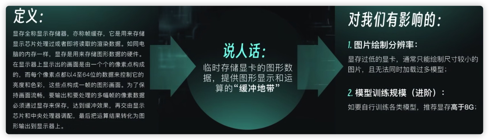
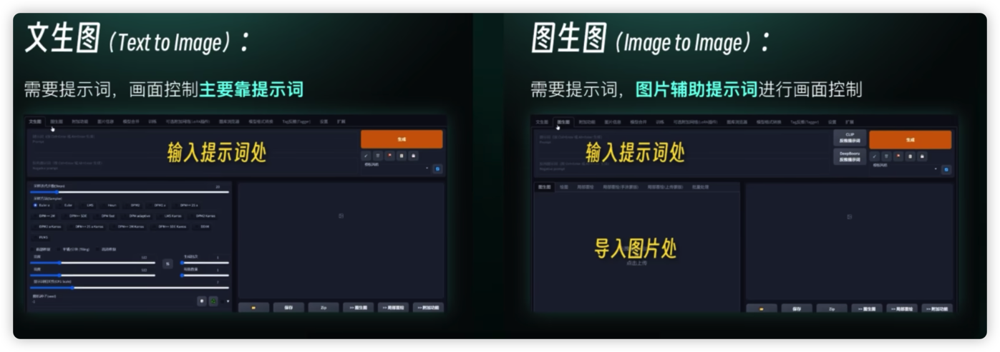
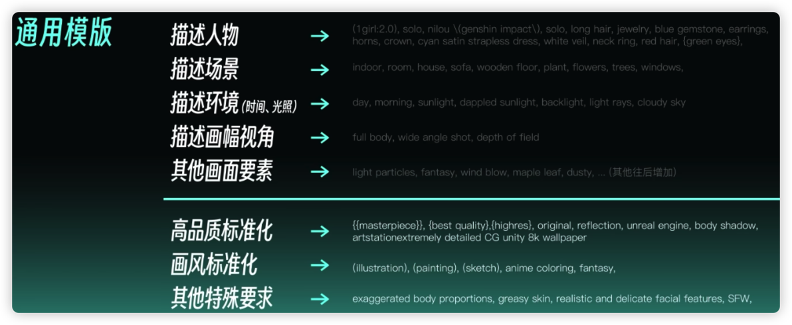
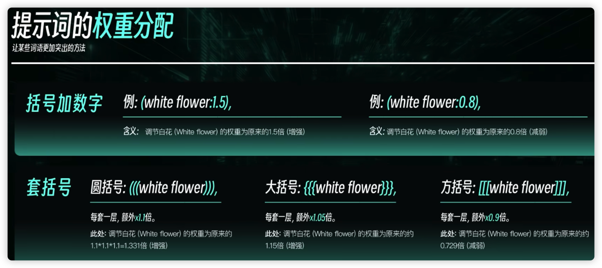
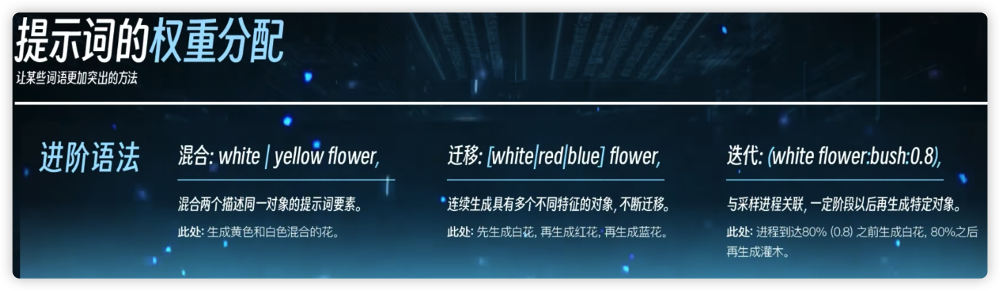
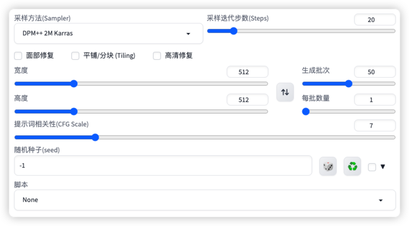

<div align="center">

<p>
 
 <p align="center"><b><font size=6>AI-Painting</font></b></p>
 <p align="center"><b>AI 绘画说明及调参</b></p>
</p>


[](LICENSE)


<div align="left">
<!-- 顶部至此截止 -->


> 参考视频：https://www.bilibili.com/video/BV16u411j7u3
>
> up 主：[Nenly同学](https://space.bilibili.com/1814756990)
>
> 工具：Stable Diffusion，SD webUI
>
> 模型来源：
>
> - https://civitai.com/models/
> - arthub.ai
>
> 提示词中文化：https://moonvy.com/apps/ops/
> 


# 原理及工具使用

## 原理

**原理：**AI 绘画的本质是“Diffusion”，中文为“扩散”。 AI 生成一张图片的基础思想简单说明如下：

学习（模型训练）->转化->去噪，并不是真的一笔一笔画出来的

1. ==扩散==：这一步也就是将将原图片增加**噪声**，使得原图片的信息进行了分散。这一步类似于我们眯起眼睛看一幅图片，照片会变得模糊
2. ==生成==：上一步“扩散”的逆过程，AI根据模型中的一些特征来去除噪声。这一步类似于我们根据想象对一副模糊的图片增加特征和细节，比如增加一些二次元的想象



## 平台及配置要求

平台：Stable Diffusion 简称“SD”，目前仅支持 Win 和 Mac 平台。显卡优先选英伟达的显卡，显存最好高于 8GB

- 显卡指标：显存

    

## 基本界面和操作流程

**启动**：Mac 上需要运行 `./webui.sh` 完成 SD 的启动

**模型放置位置**：`./models/Stable-diffusion`


# 绘制

**文生图**：仅根据提示词生成图像

**图生图**：图片辅助提示词来进行图像绘制，提示词同样重要



## 提示词（Prompt）

> 辅助书写提示词的网站：
>
> http://ai.dawnmark.cn
>
> http://www.atoolbox.net/Tool.php?Id=1101

什么是提示词（prompts），提示词是我们与AI科学高效沟通的桥梁，我们产生作画意图，使用提示词传递需求，描述画面，AI根据指令作图生成符合需要的图像。简单来讲，提示词就是我们告诉 AI，我们要画什么，画成什么。它可能包括作品主题、画风、形象特点以及一些具体包含的要素


**提示词要点：**

- 必须用英文进行书写
- 提示词是以**词组**作为单位的
- 提示词使用英文的半角逗号 `,` 进行分割


### 分类

**提示词书写分类**：

- 内容型提示词

    ```
    >>>>>>> 人物及主体特征
    
    服饰穿搭white dress
    发型发色blonde hair, long hair
    五官特点small eyes, big mouth
    面部表情smiling
    肢体动作stretching arms
    
    >>>>>>> 场景特征
    指定背景：XXXX in the background
    室内、室外indoorloutdoor
    大场景forest, city, street
    小细节 tree, bush, white flower
    
    >>>>>>> 环境光照
    白天黑夜day/night
    特定时段moning，sunset
    光环境sunlight, bright, dark
    天空blue sky,starry sky
    
    >>>>>>> 画幅视角
    背景虚化、景深：depth of field
    距离close-up,distant
    人物比例full body, upper body
    观察视角from above, view of back
    镜头类型wide angle,Sony A7l
    ```

    

- 画质（标准化）提示词

    ```
    通用高画质
    best quality, ultra-detailed, masterpiece, hires, 8k
    
    特定高分辨率类型
    extremely detailed cG unity 8k wallpaper(超精细的8K Unity游戏CG)
    unreal engine rendered (虚幻引擎渲染)
    
    插画风 illustration,painting,paintbrush
    二次元 animecomic,game CG
    写实系 photorealistic, realistic, photograph
    ```




### 权重

- **括号的使用**

    在提示词外围增加 `()`，该提示词的权重会变成原来的 1.1 倍，每加一层括号，权重就会增加 1.1 倍。**增加 n 层括号，权重增加 $1.1^n$ 倍。**

    比如 `furry -> (((furry)))`，furry 这个词的权重增加了 $1.1^3$ 倍

    

- **数字定义权重**

    通过 `(提示词:数字权重)` 来定义，数字代表权重的倍数，小于 1 减小此关键词的权重，大于 1 增加权重。比如：`(furry:1.5)`


**注意：权重最好是 1±0.5，如果个别词条的权重大于 2 会导致画面异常**





### 出图参数



- **采样迭代步数(Steps)**：绘图过程中每迭代一次画面就会更清晰，但是在 20 次之后画面的提升不大。所以建议设置在 10~20 之间


- **采样方法(Sampler)**：Ai 进行图像生成的时候使用的某种特定算法

    - `Euler` 的两个适合插画风格
    - `DPM2M`和`2M Karras`速度较快
    - `SDE Karras` 细节会较为丰富
    - `+` 代表带有有优化的

    

- **宽度&高度**：生成图像的分辨率，如果过高会导致显存爆炸，并导致多人多jio多手（因为模型在训练的时候分辨率都很低，如果分辨率过高 AI 会认为你在多图绘制）。所以，**如果想要一个分辨率高的图像，可以先使用低分辨率，然后使用高清修复（其本质是进行了一次额外的图生图）**。

    - 在进行高清修复时，建议勾选 `面部修复`，它会采用一些对抗算法识别人物面部并进行修复

    - `平铺`是用来生成那种可以无缝贴满整个屏幕的纹理性图片的，如果没需要千万别勾

        

- **提示词相关性(CFG Scale)**：值越大，AI忠实地反映你的提示词的程度就越高，但不要浮动太多建议 7~12

    

- **生成批次**：按照提示词**独立**生成的图片数量，多少次无所谓


- **每批数量**：不建议修改，増大它可以让你每批次绘制的图像数量增多，它绘制的方法是把它们拼在一起着作张更大的图片一次去画的。如果电脑不好容易爆显存


## 图生图（img2img）

图生图可以帮助你把一张图片画成另一种模样

### 图生图原理

图生图可以帮我们把一张图片画成另一种模样。在文生图中，我们是用提示词进行了绘画，但是有AI绘画具有不确定性；比如戴珍珠耳环的少女，AI 会根据自己的理解进行绘画，而生成的图像很可能不是我们想要的。所以，**在图生图中，我们所提供的图片和提示词一样，是作为一种信息提供给 AI 的，以排除不确定性；比如：可以让 AI 根据我们的构图/线稿来进行绘画。**


### 步骤

在 SD 中，只需要 3 步就可以搞定：

1. 导入图片

2. 书写提示词

    - **尽管是图生图但我们任然需要保证提示词的具体、准确**，避免 AI 只读取图片信息，没有 get 到画面中具体的信息是什么

        

3. 修改参数

    - **重回幅度**：跟原图多像，推荐为 0.6~0.8
    - **分辨率**：推荐和原图一样的分辨率。如果原图分辨率很高，最好压缩和裁切一下，不然绝对会爆显存
    - **随机数种子**：固定随机数种子再改变提示词可以


